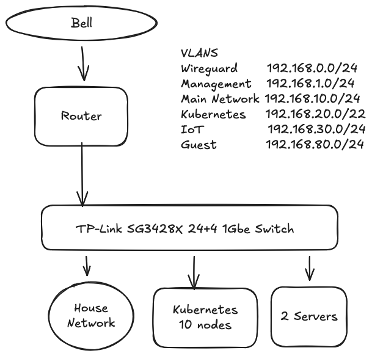

<div>


<div align="center">

#### kochhaus-home - a mono-repo for my homelab

_... managed with [Flux](https://fluxcd.io), [Renovate](https://github.com/renovatebot/renovate) and [GitHub Actions](https://github.com/features/actions)_ 🐟

</div>
</div>

<div align="center">

[](https://discord.gg/home-operations)&nbsp;&nbsp;
[](https://talos.dev)&nbsp;&nbsp;
[](https://kubernetes.io)&nbsp;&nbsp;
[](https://fluxcd.io)&nbsp;&nbsp;
[](https://github.com/haraldkoch/kochhaus-home/actions/workflows/renovate.yaml)

</div>

<div align="center">

[](https://github.com/kashalls/kromgo)&nbsp;&nbsp;
[](https://github.com/kashalls/kromgo)&nbsp;&nbsp;
[](https://github.com/kashalls/kromgo)&nbsp;&nbsp;
[](https://github.com/kashalls/kromgo)&nbsp;&nbsp;
[](https://github.com/kashalls/kromgo)&nbsp;&nbsp;
[](https://github.com/kashalls/kromgo)&nbsp;&nbsp;
[](https://github.com/kashalls/kromgo)&nbsp;&nbsp;
[](https://github.com/kashalls/kromgo)

</div>

<div align="center">

[](https://github.com/auchenberg/volkswagen)

</div>

---

## Overview

This is a monorepository for my home Kubernetes clusters. I try to adhere to Infrastructure as Code (IaC) and GitOps practices using tools like [Ansible](https://www.ansible.com/), [Terraform](https://www.terraform.io/), [Kubernetes](https://kubernetes.io/), [Flux](https://github.com/fluxcd/flux2), [Renovate](https://github.com/renovatebot/renovate), and [GitHub Actions](https://github.com/features/actions).

---

## ⛵ Kubernetes

My Kubernetes clusters are deployed with [Talos](https://www.talos.dev). They are hyper-converged clusters, workloads and block storage are sharing the same available resources on my nodes while I have a separate server with ZFS for NFS/SMB shares, bulk file storage and backups.

There is a template over at [onedr0p/cluster-template](https://github.com/onedr0p/cluster-template) if you want to try and follow along with some of the practices I use here.

### Core Components

- **Networking & Service Mesh**: [cilium](https://github.com/cilium/cilium) provides eBPF-based networking, while [envoy](https://gateway.envoyproxy.io/) powers service-to-service communication with L7 proxying and traffic management. [cloudflared](https://github.com/cloudflare/cloudflared) secures ingress traffic via Cloudflare, and [external-dns](https://github.com/kubernetes-sigs/external-dns) keeps DNS records in sync automatically.
- **Security & Secrets**: [cert-manager](https://github.com/cert-manager/cert-manager) automates SSL/TLS certificate management. For secrets, I use [external-secrets](https://github.com/external-secrets/external-secrets) with [1Password Connect](https://github.com/1Password/connect) to inject secrets into Kubernetes, and [sops](https://github.com/getsops/sops) to store and manage encrypted secrets in Git.
- **Storage & Data Protection**: [rook](https://github.com/rook/rook) or [longhorn](https://longhorn.io/) provide distributed storage for persistent volumes, with [volsync](https://github.com/backube/volsync) handling backups and restores. [harbor](https://goharbor.io/) improves reliability by running a site-wide OCI image mirror.
- **Automation & CI/CD**: [actions-runner-controller](https://github.com/actions/actions-runner-controller) runs self-hosted GitHub Actions runners directly in the cluster for continuous integration workflows.

### GitOps

[Flux](https://github.com/fluxcd/flux2) watches the clusters in my [kubernetes](./kubernetes/) folder (see Directories below) and makes the changes to my clusters based on the state of my Git repository.

The way Flux works for me here is it will recursively search the `kubernetes/${cluster}/apps` folder until it finds the most top level `kustomization.yaml` per directory and then apply all the resources listed in it. That aforementioned `kustomization.yaml` will generally only have a namespace resource and one or many Flux kustomizations (`ks.yaml`). Under the control of those Flux kustomizations there will be a `HelmRelease` or other resources related to the application which will be applied.

[Renovate](https://github.com/renovatebot/renovate) watches my **entire** repository looking for dependency updates, when they are found a PR is automatically created. When some PRs are merged Flux applies the changes to my cluster.

### Wow

Yes, this is a lot of infrastructure and heavy lifting - the point is to experiment with Kubernetes and GitOps in a safe space.

[](https://twitter.com/dexhorthy/)

### Directories

This Git repository contains the following directories under [Kubernetes](./kubernetes/).

```sh
📁 kubernetes
├── 📁 main            # main cluster
│   ├── 📁 apps           # applications
│   ├── 📁 components     # re-useable components
│   └── 📁 flux           # core flux configuration
└── 📁 registry        # registry cluster (running harbor)
    ├── 📁 apps           # applications
    └── 📁 flux           # core flux configuration
```

### Networking

<details>
  <summary>Click here to see my high-level network diagram</summary>

  
</details>

---

## ☁️ Cloud Dependencies

While most of my infrastructure and workloads are self-hosted I do rely upon the cloud for certain key parts of my setup. This saves me from having to worry about three things. (1) Dealing with chicken/egg scenarios, (2) services I critically need whether my cluster is online or not and (3) The "hit by a bus factor" - what happens to critical apps (e.g. Email, Password Manager, Photos) that my family relies on when I no longer around.

Alternative solutions to the first two of these problems would be to host a Kubernetes cluster in the cloud and deploy applications like [HCVault](https://www.vaultproject.io/), [Vaultwarden](https://github.com/dani-garcia/vaultwarden), [ntfy](https://ntfy.sh/), and [Gatus](https://gatus.io/); however, maintaining another cluster and monitoring another group of workloads would be more work and probably be more or equal out to the same costs as described below.

| Service                                    | Use                                                            | Cost           |
|--------------------------------------------|----------------------------------------------------------------|----------------|
| [1Password](https://1password.com/)        | Secrets with [External Secrets](https://external-secrets.io/)  | ~$65/yr        |
| [Cloudflare](https://www.cloudflare.com/)  | Domain and S3                                                  | Free           |
| [Fastmail](https://www.fastmail.com/)      | Email hosting                                                  | ~$120/yr       |
| [GitHub](https://github.com/)              | Hosting this repository and continuous integration/deployments | Free           |
| [Linode](https://linode.com/)              | servers hosting my email and public web                        | ~$25/mo        |
| [Pushover](https://pushover.net/)          | Kubernetes Alerts and application notifications                | $5 OTP         |
| [healthchecks.io](https://healthchecks.io) | Monitoring internet connectivity and Prometheus status         | Free           |
|                                            |                                                                | Total: ~$40/mo |

---

## 🌐 DNS

I have a pair of Raspberry Pi 4s running [Bind9](https://github.com/isc-projects/bind9) and [blocky](https://github.com/0xERR0R/blocky) deployed.

In my cluster there are two instances of [ExternalDNS](https://github.com/kubernetes-sigs/external-dns) running. One for syncing private DNS records to the primary Bind instance, while another instance syncs public DNS to `Cloudflare`. This setup is managed by creating `httproutes` with two specific classes: `internal` for private DNS and `external` for public DNS. The `external-dns` instances then syncs the DNS records to their respective platforms accordingly.

---

## 🔧 Hardware

### Main Kubernetes Cluster

| Node                | CPU               |  RAM | Storage    | Function             | OS          |
|---------------------|-------------------|------|------------|----------------------|-------------|
| HP EliteDesk 800 G2 | Intel i5-6500T    | 16GB | 240GB SSD  | control-plane        | Talos Linux |
| HP EliteDesk 800 G2 | Intel i5-6500T    | 16GB | 240GB SSD  | control-plane        | Talos Linux |
| HP EliteDesk 800 G2 | Intel i5-6500T    | 16GB | 240GB SSD  | control-plane        | Talos Linux |
| Lenovo M910q tiny   | Intel i5-6500T    | 16GB | 512GB NVMe | worker, ceph storage | Talos Linux |
| Lenovo M900q tiny   | Intel i5-6500T    | 16GB | 512GB SSD  | worker, ceph storage | Talos Linux |
| Lenovo M910q tiny   | Intel i5-6500T    | 16GB | 512GB NVMe | worker, ceph storage | Talos Linux |

### Registry Kubernetes Cluster

| Node                | CPU               | RAM | Storage     | Function             | OS          |
|---------------------|-------------------|-----|-------------|----------------------|-------------|
| Lenovo M900q tiny   | Intel i5-6500T    | 8GB | 128GB SSD   | single-node cluster  | Talos Linux |

### Infrastructure Kubernetes Cluster

| Node                | CPU               | RAM  | Storage    | Function             | OS          |
|---------------------|-------------------|------|------------|----------------------|-------------|
| Turing RK1          | Cortex A76/A55    | 16GB | 1TB NVMe   | control-plane/worker | Talos Linux |
| Turing RK1          | Cortex A76/A55    | 16GB | 1TB NVMe   | control-plane/worker | Talos Linux |
| Turing RK1          | Cortex A76/A55    | 16GB | 1TB NVMe   | control-plane/worker | Talos Linux |
### Other

| Device           | CPU                 | RAM  | Storage                     | Function             | OS         |
|------------------|---------------------|------|-----------------------------|----------------------|------------|
| Blackbox         | Ryzen 5 1600        | 64GB | 4x4TB ZFS (mirrored VDEVs)  | compute server (VMs) | Arch Linux |
| Blackbox         | AMD Athlon 3000G    | 16GB | 4x16TB ZFS (mirrored VDEVs) | NFS + Backup Server  | Arch Linux |
| PiKVM  * 2       | RPi 4 (Cortex A72)  |  2GB | -                           | KVM for servers      | -          |
| Blackbox         | Intel N5105         |  8GB | 128GB NVMe                  | Router / Firewall    | OPNSense   |
| TP-Link SG3428X  | -                   |      | -                           | 24+4 Switch          | -          |
| Raspberry Pi 4   | Cortex A72          |  8GB | 240GB SSD                   | DNS servers (x2)     | Arch Linux |
| Raspberry Pi 4   | Cortex A72          |  4GB | 240GB SSD                   | Home Assistant       | HAOS       |

---

## ⭐ Stargazers

<div align="center">

[](https://star-history.com/#haraldkoch/kochhaus-home&Date)

</div>

---

## 🤝 Thanks

Big shout out to original [cluster-template](https://github.com/onedr0p/cluster-template), and the [Home Operations](https://discord.gg/home-operations) Discord community.

Be sure to check out [kubesearch.dev](https://kubesearch.dev/) for ideas on how to deploy applications or get ideas on what you could deploy.
