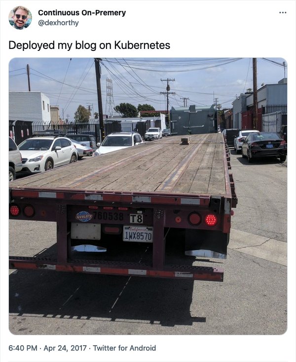

<div>


#### kochhaus-home - a mono-repo for my homelab

_... automated via [Flux](https://fluxcd.io), [Renovate](https://github.com/renovatebot/renovate) and [GitHub Actions](https://github.com/features/actions)_ 🐟

</div>

<div align="center">

[](https://discord.gg/home-operations)&nbsp;&nbsp;
[](https://k3s.io/)&nbsp;&nbsp;
[](https://github.com/haraldkoch/kochhaus-home/actions/workflows/renovate.yaml)

</div>

<div align="center">

[](https://github.com/kashalls/kromgo)&nbsp;&nbsp;
[](https://github.com/kashalls/kromgo)&nbsp;&nbsp;
[](https://github.com/kashalls/kromgo)&nbsp;&nbsp;
[](https://github.com/kashalls/kromgo)&nbsp;&nbsp;
[](https://github.com/kashalls/kromgo)&nbsp;&nbsp;
[](https://github.com/kashalls/kromgo)&nbsp;&nbsp;
[](https://github.com/kashalls/kromgo)&nbsp;&nbsp;
[](https://github.com/kashalls/kromgo)

</div>

<div align="center">

[](https://github.com/auchenberg/volkswagen)

</div>

---

## Overview

This is a monorepository for my home Kubernetes clusters.
I try to adhere to Infrastructure as Code (IaC) and GitOps practices using tools like [Ansible](https://www.ansible.com/), [Terraform](https://www.terraform.io/), [Kubernetes](https://kubernetes.io/), [Flux](https://github.com/fluxcd/flux2), [Renovate](https://github.com/renovatebot/renovate), and [GitHub Actions](https://github.com/features/actions).

The purpose here is to learn Kubernetes, while practicing GitOps. I have two longer-term goals:

1. migrate many of the services that I currently run on Linode to my HomeLab.
2. Build a small Raspberry Pi cluster at home to run a infrastructure, with the intent of being able to run critical components from a UPS during power outages.

---

## ⛵ Kubernetes

There is a template over at [onedr0p/flux-cluster-template](https://github.com/onedr0p/flux-cluster-template) if you want to try and follow along with some of the practices I use here.

### Installation

My cluster is built using [k3s](https://k3s.io/), provisioned on bare-metal Arch Linux using the [Ansible](https://www.ansible.com/) galaxy role [ansible-role-k3s](https://github.com/PyratLabs/ansible-role-k3s). This is a hyper-converged cluster, workloads and block storage are sharing the same available resources on my nodes. I also have a separate NAS server with ZFS for NFS/SMB shares, bulk file storage and backups.

### Core Components

- [actions-runner-controller](https://github.com/actions/actions-runner-controller): self-hosted Github runners
- [calico](https://www.tigera.io/project-calico/): container networking with IPv6 support and policy enforcement.
- [cert-manager](https://cert-manager.io/docs/): Configured to create TLS certs for all ingress services automatically using LetsEncrypt.
- [external-dns](https://github.com/kubernetes-sigs/external-dns): monitors service and ingress resources, and automatically generates DNS updates for them. This lets me maintain DNS mappings and LetsEncrypt certificates without a cloudflare account or domain.
- [external-secrets](https://github.com/external-secrets/external-secrets/): managed Kubernetes secrets using [1Password](https://1password.com/).
- [ingress-nginx](https://github.com/kubernetes/ingress-nginx/): ingress controller for Kubernetes using NGINX as a reverse proxy and load balancer
- [rook-ceph](https://rook.io/): Cloud native distributed block storage for Kubernetes
- [sops](https://toolkit.fluxcd.io/guides/mozilla-sops/): managed secrets for Kubernetes, Ansible, and Terraform which are committed to Git
- [volsync](https://github.com/backube/volsync): backup and recovery of persistent volume claims

### GitOps

[Flux](https://github.com/fluxcd/flux2) watches the clusters in my [kubernetes](./kubernetes/) folder (see Directories below) and makes the changes to my clusters based on the state of my Git repository.

The way Flux works for me here is it will recursively search the `kubernetes/${cluster}/apps` folder until it finds the most top level `kustomization.yaml` per directory and then apply all the resources listed in it. That aforementioned `kustomization.yaml` will generally only have a namespace resource and one or many Flux kustomizations. Those Flux kustomizations will generally have a `HelmRelease` or other resources related to the application underneath it which will be applied.

[Renovate](https://github.com/renovatebot/renovate) watches my **entire** repository looking for dependency updates, when they are found a PR is automatically created. When some PRs are merged Flux applies the changes to my cluster.

### Wow

Yes, this is a lot of infrastructure and heavy lifting - the point is to experiment with Kubernetes and GitOps in a safe space.

[](https://twitter.com/dexhorthy/)

### Directories

This Git repository contains the following directories under [Kubernetes](./kubernetes/).

```sh
📁 kubernetes
├── 📁 main            # main cluster
│   ├── 📁 apps           # applications
│   ├── 📁 bootstrap      # bootstrap procedures
│   ├── 📁 components     # re-useable components
│   └── 📁 flux           # core flux configuration
└── 📁 registry        # registry cluster (running harbor)
    ├── 📁 apps           # applications
    ├── 📁 bootstrap      # bootstrap procedures
    └── 📁 flux           # core flux configuration
```

---

## ☁️ Cloud Dependencies

While most of my infrastructure and workloads are self-hosted I do rely upon the cloud for certain key parts of my setup. This saves me from having to worry about two things. (1) Dealing with chicken/egg scenarios and (2) services I critically need whether my cluster is online or not.

The alternative solution to these two problems would be to host a Kubernetes cluster in the cloud and deploy applications like [HCVault](https://www.vaultproject.io/), [Vaultwarden](https://github.com/dani-garcia/vaultwarden), [ntfy](https://ntfy.sh/), and [Gatus](https://gatus.io/). However, maintaining another cluster and monitoring another group of workloads is a lot more time and effort than I am willing to put in.

| Service                                         | Use                                                               | Cost           |
|-------------------------------------------------|-------------------------------------------------------------------|----------------|
| [1Password](https://1password.com/)             | Secrets with [External Secrets](https://external-secrets.io/)     | ~$60/yr        |
| [Cloudflare](https://www.cloudflare.com/)       | Domain and S3                                                     | Free           |
| [GitHub](https://github.com/)                   | Hosting this repository and continuous integration/deployments    | Free           |
| [Linode](https://linode.com/)                   | servers hosting my email and public web                           | Free           |
| [Pushover](https://pushover.net/)               | Kubernetes Alerts and application notifications                   | $5 OTP         |
| [healthchecks.io](https://healthchecks.io)      | Monitoring internet connectivity and Prometheus status            | Free           |
|                                                 |                                                                   | Total: ~$5/mo  |

---

## 🌐 DNS

### Home DNS

On a pair of Raspberry Pi 3s, I have [Bind9](https://github.com/isc-projects/bind9) and [blocky](https://github.com/0xERR0R/blocky) deployed. In my cluster `external-dns` is deployed with the `RFC2136` provider which syncs DNS records to `bind9`. `blocky` is used by non-servers as ad-blocking and caching proxy, using `bind9` for local lookups.

### Public DNS

Outside the `external-dns` instance mentioned above another instance is deployed in my cluster and configured to sync DNS records to [Cloudflare](https://www.cloudflare.com/). The only ingress this `external-dns` instance looks at to gather DNS records to put in `Cloudflare` are ones that have an ingress class name of `external` and contain an ingress annotation `external-dns.alpha.kubernetes.io/target`.

---

## 🔧 Hardware

### Main Kubernetes Cluster

| Node                | CPU               |  RAM | Storage    | Function             | OS         |
|---------------------|-------------------|------|------------|----------------------|------------|
| HP EliteDesk 800 G2 | Intel i5-6500T    | 16GB | 240GB SSD  | control-plane        | Arch Linux |
| HP EliteDesk 800 G2 | Intel i5-6500T    | 16GB | 240GB SSD  | control-plane        | Arch Linux |
| HP EliteDesk 800 G2 | Intel i5-6500T    | 16GB | 240GB SSD  | control-plane        | Arch Linux |
| Lenovo M910q tiny   | Intel i5-6500T    | 16GB | 512GB NVMe | worker, ceph storage | Arch Linux |
| Lenovo M900q tiny   | Intel i5-6500T    | 16GB | 512GB SSD  | worker, ceph storage | Arch Linux |
| Lenovo M910q tiny   | Intel i5-6500T    | 16GB | 512GB NVMe | worker, ceph storage | Arch Linux |

### Registry Kubernetes Cluster

| Node        | CPU               | RAM | Storage   | Function            | OS         |
|-------------|-------------------|-----|-----------|---------------------|------------|
| libvirtd VM | AMD Ryzen 5 1600T | 8GB | 128GB HDD | single-node cluster | Arch Linux |

### Infrastructure Kubernetes Cluster (coming soon)

| Node       | CPU            | RAM  | Storage  | Function      | OS     |
|------------|----------------|------|----------|---------------|--------|
| Turing RK1 | Cortex A76/A55 | 16GB | 1TB NVMe | control-plane | Debian |
| Turing RK1 | Cortex A76/A55 | 16GB | 1TB NVMe | control-plane | Debian |
| Turing RK1 | Cortex A76/A55 | 16GB | 1TB NVMe | control-plane | Debian |

---

## ⭐ Stargazers

<div align="center">

[](https://star-history.com/#haraldkoch/kochhaus-home&Date)

</div>

---

## 🤝 Thanks

Big shout out to original [flux-cluster-template](https://github.com/onedr0p/flux-cluster-template), and the [Home Operations](https://discord.gg/home-operations) Discord community.

Be sure to check out [kubesearch.dev](https://kubesearch.dev/) for ideas on how to deploy applications or get ideas on what you may deploy.
